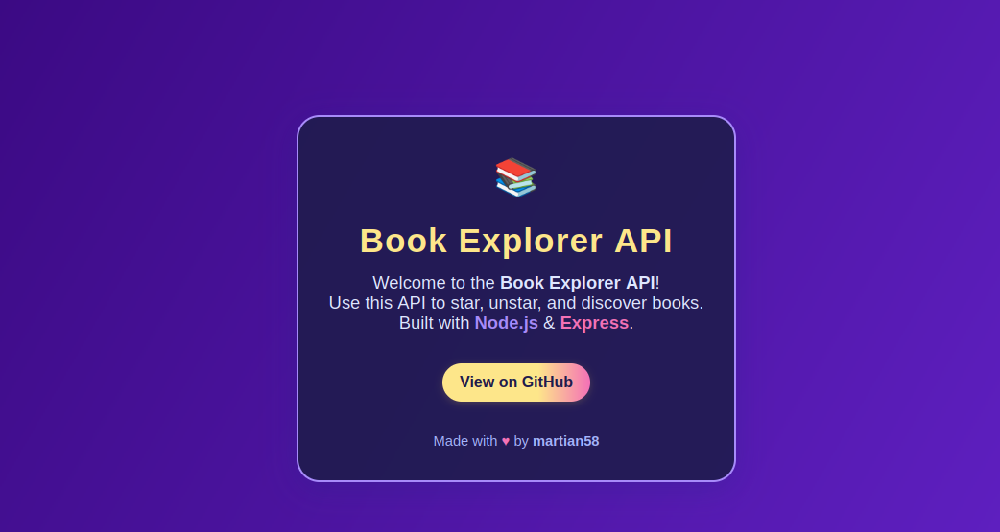

# 📚 Book Explorer API

Welcome to **Book Explorer API** – a modern, cloud-ready REST API for managing your starred books, built for the [Book Explorer](https://github.com/martian58/book-explorer) app and anyone who wants a simple way to save, unstar, and fetch favorite books using Open Library data.

---

## 🌟 Features

- **Star & Unstar Books:** Authenticated users can star or unstar any book by Open Library Work ID.
- **Get Starred Books:** Instantly fetch your personal list of favorites.
- **Authentication:** Secure endpoints with [Clerk](https://clerk.com/) JWT-based authentication.
- **CORS & Modern Security:** Safe for modern web frontends.
- **Express.js:** Fast, minimal, and easy to extend.
- **Beautiful Welcome Page:** Visit the root endpoint (`/`) for a delightful API splash.

---

## 🚀 Quick Start

### 1. **Clone & Install**

```bash
git clone https://github.com/martian58/book-explorer-api.git
cd book-explorer-api
npm install
```

### 2. **Environment Variables**

Create a `.env` file:

```env
DATABASE_URL=your_neon_serverless_connection_string
CLERK_PUBLISHABLE_KEY=your_publishable_key
CLERK_SECRET_KEY=your_secret_key
NODE_ENV=development
```

### 3. **Run the Server**

```bash
npm run dev
```

Your API is now live at `http://localhost:3000/` 🎉

---

## 🔑 Authentication

All star/unstar and favorites endpoints require a valid Clerk JWT in the `Authorization` header:

```
Authorization: Bearer <token>
```

You can get this token from the Book Explorer frontend or directly from Clerk.

---

## 📖 API Endpoints

| Method | Endpoint              | Auth Required | Description                       |
|--------|----------------------|---------------|-----------------------------------|
| GET    | `/`                  | ❌            | Welcome page                      |
| GET    | `/api/starred`       | ✅            | List IDs of books you starred     |
| POST   | `/api/starred/:id`   | ✅            | Star a book by work ID            |
| DELETE | `/api/starred/:id`   | ✅            | Unstar a book by work ID          |

### Example: Star a Book

```http
POST /api/starred/OL82563W
Authorization: Bearer <your-token>
```

---

## 🛠️ Tech Stack

- **Node.js** + **Express.js**
- **Clerk** for authentication
- **MongoDB** (or any supported store) for user favorites
- **Open Library** for book metadata

---

## 🌍 Deployment

- **Ready for Vercel, Railway, Render, Heroku, and more.**
- Just set your env vars and deploy!

---

## ⚡ Example Welcome Page



---

## 🤝 Contributing

Pull requests and issues are welcome!  
See [CONTRIBUTING.md](CONTRIBUTING.md) for guidelines.

---

## 📄 License

MIT

---

## 💫 Credits

- API by [@martian58](https://github.com/martian58)
- Built for [Book Explorer](https://github.com/martian58/book-explorer)
- Book data: [Open Library](https://openlibrary.org/)
- Auth: [Clerk](https://clerk.com/)

---